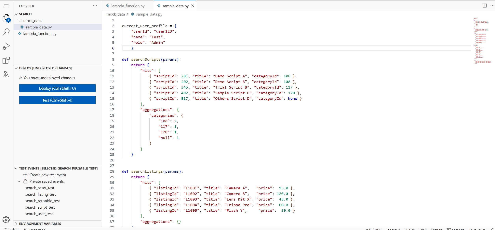
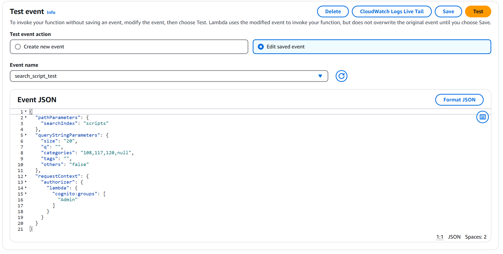
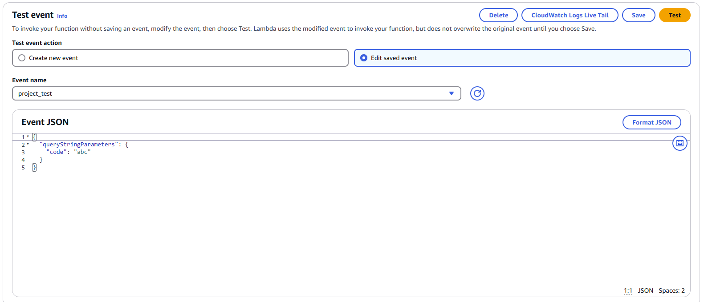
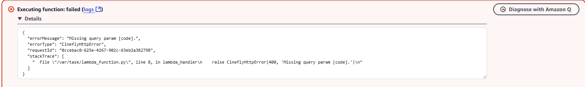

# Cinefly_Backend_internship

## Summary of Steps

- **Rewrote core functions** – Ensured correct syntax for Python and Lambda compatibility.
- **Learned basic Lambda setup** – Reviewed AWS documentation for creating Python-based Lambda functions.
- **Watched testing tutorials** – Learned how to use test events in the Lambda console.
- **Performed basic validation** – Verified that input parameters and return values match expectations.

## Search Function Test Results

- All tests were performed using mock data and Lambda test events.

### Created a separate file for the mock back-end data

 

 

1. **Search Script Test Event**
   

    **Search Script Event Inputs**
   

    **Search Script TE Results**
   

2. **Search Listing Test Event**
   

    **Search Listing Event Inputs**
   

    **Search Listing TE Results**
   

3. **Search User Test Event**
   

    **Search User Event Inputs**
   

    **Search User TE Results**
   

4. **Search Asset Test Event**
   

    **Search Asset Event Inputs**
   

    **Search Asset TE Results**
   

5. **Search ReusableAsset Test Event**
   

    **Search ReusableAsset Event Inputs**
   

    **Search ReusableAsset TE Results**
   

## Project Function Test Results

 

1. **Project Test Event 1**
   

    **Project Fetched Successfully**
   

2. **Project Test Event 2**
   

    **Project 400 Error**
   

3. **Project Test Event 3**
   

    **Project 404 Error**
   